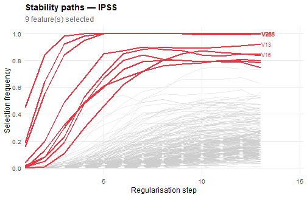

# Getting started with FGstab

## Overview

**FGstab** implements Integrated Path Stability Selection (IPSS) for
high-dimensional variable selection in the Fine-Gray competing risks
regression model. The method extends the stability selection framework
of Meinshausen & Bühlmann (2010) to the penalised Fine-Gray estimator.
At each subsampling step, an L1-penalised Fine-Gray model is fitted on
the subdistribution hazard (Fu, Parikh & Zhou, 2017), and selection
frequencies are aggregated across the regularisation path to produce
stable, interpretable results.

The core idea is simple: instead of fitting a single LASSO model, the
data is repeatedly split in half and a LASSO Fine-Gray model is fitted
on each half-sample across a grid of regularisation values $`\lambda`$.
The *selection frequency* of each feature — the proportion of
half-samples in which it receives a non-zero coefficient — is tracked
along the path. Features that are consistently selected across many
subsamples and many values of $`\lambda`$ are considered reliable.

------------------------------------------------------------------------

## Installation

``` r

# Install fastcmprsk from GitHub (required dependency, not on CRAN)
devtools::install_github("erickawaguchi/fastcmprsk")

# Install FGstab
remotes::install_github("hugocannafarina/FGstab")
```

``` r

library(FGstab)
```

------------------------------------------------------------------------

## Simulating competing risks data

[`sim_competing()`](https://hugocannafarina.github.io/FGstab/reference/sim_competing.md)
generates synthetic data from the Fine-Gray model with a user-controlled
covariance structure. We use the independent design here for simplicity.

``` r

set.seed(42)
dat <- sim_competing(
  n_ind       = 200,
  n_pred      = 10,
  n_var       = 300,
  design      = "independent",
  censor_rate = 0.3
)

# dat$X               — covariate matrix (200 x 300), centred and scaled
# dat$surv            — data frame: Tobs, evtype (0/1/2), id
# dat$true_pred_index — indices of the 10 truly predictive features
# dat$beta            — true coefficient vector

table(dat$surv$evtype)
#> 
#>  0  1  2 
#> 60 81 59
```

The outcome matrix `y` passed to
[`FGstab()`](https://hugocannafarina.github.io/FGstab/reference/FGstab.md)
must have two columns: observed time and event type (0 = censored, 1 =
event of interest, 2 = competing event).

``` r

y <- cbind(time = dat$surv$Tobs, status = dat$surv$evtype)
```

------------------------------------------------------------------------

## The IPSS method

### Stability paths

For each of $`B = 100`$ subsampling iterations, the data is split into
two halves of size $`\lfloor n/2 \rfloor`$. On each half, a LASSO
Fine-Gray model is fitted over a grid of $`\lambda`$ values from
$`\lambda_{\max}`$ (no feature selected) down to
$`0.05 \cdot \lambda_{\max}`$. The selection frequency of feature $`j`$
at regularisation parameter $`\lambda`$ is:

``` math
\hat{\Pi}_j(\lambda) = \frac{1}{2B} \sum_{k=1}^{2B}
  \mathbf{1}\!\left[\hat{\beta}_j^{(k)}(\lambda) \neq 0\right]
```

Plotting $`\hat{\Pi}_j(\lambda)`$ against $`1/\lambda`$ yields the
*stability path* of feature $`j`$. Features with high maximum selection
probability across the path are most reliably associated with the
outcome.

### IPSS scores and the EFP bound

IPSS integrates the stability paths to produce a score for each feature
that upper-bounds the expected number of false positives (EFP). The
bound depends on the choice of bounding function $`h_m`$ (controlled by
`ipss_function`):

``` math
h_m(\pi) = \begin{cases} 0 & \text{if } \pi \leq 0.5 \\ (2\pi - 1)^m & \text{if } \pi > 0.5 \end{cases}
```

with $`m = 1`$ (`"h1"`), $`m = 2`$ (`"h2"`, default), or $`m = 3`$
(`"h3"`). Higher $`m`$ gives a tighter but more conservative bound. The
integrated bound is:

``` math
\widehat{\mathrm{EFP}} \leq \frac{\hat{\Psi}}{S_j}
```

where $`\hat{\Psi}`$ is the integrated upper bound on the expected
number of false positives (a function of $`B`$, $`p`$, and $`m`$), and
$`S_j`$ is the integrated stability path of feature $`j`$ transformed by
$`h_m`$.

The **EFP score** of feature $`j`$ is defined as:

``` math
\mathrm{EFP}_j = \frac{\hat{\Psi}}{\max(S_j,\, \hat{\Psi}/p)}
```

A low EFP score means that selecting feature $`j`$ implies a small
expected number of false positives in the selected set.

### Q-values

Q-values are derived from EFP scores analogously to the
Benjamini-Hochberg procedure. The q-value of feature $`j`$ is the
minimum FDR achievable over all selected sets that include feature
$`j`$:

``` math
q_j = \min_{t \,:\, \mathrm{EFP}_t \leq \mathrm{EFP}_j}
  \frac{\max_{k:\, \mathrm{EFP}_k \leq t} \mathrm{EFP}_k}{|\{k : \mathrm{EFP}_k \leq t\}|}
```

------------------------------------------------------------------------

## Running FGstab

### Inspect scores without selecting

``` r

res <- FGstab(
  X             = dat$X,
  y             = y,
  n_alphas      = 15,
  ipss_function = "h2",
  n_jobs        = 1        # set higher in practice
)
print(res)
#> === FGstab Result (IPSS) ===
#> Features tested  : 300 
#> Features selected: 9 
#> Selected indices : 13, 16, 36, 40, 192, 212, 234, 255, 288
```

The result contains `efp_scores` and `q_values` for all features, which
you can inspect before choosing a threshold:

``` r

# 10 most stable features (lowest EFP scores)
efp_sorted <- sort(unlist(res$efp_scores))
head(round(efp_sorted, 4), 10)
#>    288     36    255     16     13     40    234    192    212    175 
#> 0.0556 0.0622 0.0669 0.1250 0.1394 0.2420 0.2981 0.3299 0.5814 8.8899
```

### Controlling the expected number of false positives

Setting `target_fp = 1` selects all features whose EFP score is at most
1, meaning that at most 1 false positive is expected in the selected set
on average.

``` r

res_fp <- FGstab(dat$X, y, n_alphas = 15, target_fp = 1, n_jobs = 1)
print(res_fp)
#> === FGstab Result (IPSS) ===
#> Features tested  : 300 
#> Features selected: 9 
#> Selected indices : 13, 16, 36, 40, 192, 212, 234, 255, 288

# How many true positives did we recover?
tp <- sum(res_fp$selected_features %in% dat$true_pred_index)
fp <- length(res_fp$selected_features) - tp
cat("True positives :", tp, "\n")
#> True positives : 8
cat("False positives:", fp, "\n")
#> False positives: 1
```

### Controlling the FDR

Setting `target_fdr = 0.2` selects features whose q-value is at most
0.2.

``` r

res_fdr <- FGstab(dat$X, y, n_alphas = 15, target_fdr = 0.2, n_jobs = 1)
summary(res_fdr)
#> === Summary: FGstab Result (IPSS) ===
#> Features tested        : 300 
#> Regularisation steps   : 13 
#> Features selected      : 9 
#> 
#> EFP scores (top 10 most stable features):
#>    288     36    255     16     13    192     40    234    212    218 
#> 0.0538 0.0602 0.0650 0.1448 0.1834 0.2596 0.3621 0.4784 0.6581 5.7595 
#> 
#> Q-values (selected features):
#>     13     16     36     40    192    212    234    255    288 
#> 0.0367 0.0362 0.0217 0.0517 0.0433 0.0731 0.0598 0.0217 0.0217
```

------------------------------------------------------------------------

## Standard survival data (Cox model)

When there are no competing events,
[`FGstab()`](https://hugocannafarina.github.io/FGstab/reference/FGstab.md)
is equivalent to IPSS for the penalised Cox model. Use
[`sim_survival()`](https://hugocannafarina.github.io/FGstab/reference/sim_survival.md)
to simulate data in that setting — the output format is identical to
[`sim_competing()`](https://hugocannafarina.github.io/FGstab/reference/sim_competing.md)
but `evtype` only takes values 0 (censored) and 1 (event).

``` r

dat_cox <- sim_survival(n_ind = 200, n_pred = 10, n_var = 300,
                        design = "independent")
y_cox   <- as.matrix(dat_cox$surv[, c("Tobs", "evtype")])

res_cox <- FGstab(dat_cox$X, y_cox, n_alphas = 15, target_fdr = 0.2, n_jobs = 1)
print(res_cox)
#> === FGstab Result (IPSS) ===
#> Features tested  : 300 
#> Features selected: 6 
#> Selected indices : 21, 51, 93, 117, 125, 254
```

------------------------------------------------------------------------

## Visualising stability paths

[`plot()`](https://rdrr.io/r/graphics/plot.default.html) displays the
stability paths of all features. Selected features are highlighted in
red; the top-5 most stable features are labelled on the right margin.

``` r

plot(res_fdr)
```



plot of chunk plot

You can increase `n_highlight` to label more features, or save the plot:

``` r

p <- plot(res_fdr, n_highlight = 10)
ggplot2::ggsave("stability_paths.pdf", p, width = 8, height = 5)
```

------------------------------------------------------------------------

## Covariance structures in sim_competing

[`sim_competing()`](https://hugocannafarina.github.io/FGstab/reference/sim_competing.md)
supports three designs for the covariate matrix
$`X \sim \mathcal{N}(0, \Sigma)`$:

| Design          | $`\Sigma_{jk}`$                           |
|-----------------|-------------------------------------------|
| `"independent"` | $`\mathbf{I}_p`$                          |
| `"toeplitz"`    | $`\rho^{|j-k|}`$                          |
| `"block"`       | 0.5 within blocks of size 10, 0 otherwise |

``` r

dat_toep <- sim_competing(n_ind = 200, n_pred = 10, n_var = 300,
                          design = "toeplitz", rho = 0.7)
```

------------------------------------------------------------------------

## Choosing `ipss_function`

The three bounding functions differ in conservatism:

| `ipss_function` | $`m`$ | Behaviour                                 |
|-----------------|-------|-------------------------------------------|
| `"h1"`          | 1     | Least conservative, selects more features |
| `"h2"`          | 2     | Default, good balance                     |
| `"h3"`          | 3     | Most conservative, selects fewer features |

In practice, `"h2"` is a robust default. Use `"h3"` if you want to be
more stringent, or `"h1"` if the signal is weak and you can tolerate
more false positives.

------------------------------------------------------------------------

## References

- Melikechi, O. & Miller, J. W. (2026). Integrated path stability
  selection. *Journal of the American Statistical Association*,
  121(553), 454–464.
- Meinshausen, N. & Bühlmann, P. (2010). Stability selection. *Journal
  of the Royal Statistical Society: Series B*, 72(4), 417–473.
- Fu, Z., Parikh, C. R. & Zhou, B. (2017). Penalized variable selection
  in competing risks regression. *Lifetime Data Analysis*, 23(3),
  353–376.
- Fine, J. P. & Gray, R. J. (1999). A proportional hazards model for the
  subdistribution of a competing risk. *JASA*, 94(446), 496–509.
